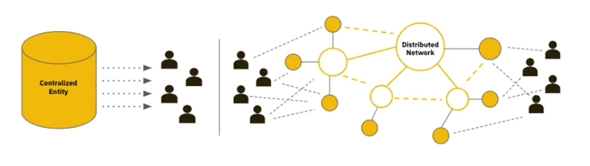

# 区块链是什么？

<figure><figcaption></figcaption></figure>

\*来源：Binance Research

区块链是一种分布式数据库技术，它将数据分布式存储在多个节点上，并使用密码学技术确保数据的安全性和不可篡改性。区块链通过一个个相互连接的区块构成的链式结构来组织数据，每个区块包含一定数量的交易数据和元数据，包括时间戳、前一个区块的哈希值等。区块链的特点包括去中心化、分布式共识、加密技术和智能合约等。与传统网络相比，区块链核心特点为：

* 去中心化：区块链是一个去中心化的系统，数据存储在网络上的多个节点中，而不是集中在单一的中心化服务器上。这使得区块链具有抗审查和抗攻击的特性，提高了数据的安全性和可靠性。
* 不可篡改性：区块链使用密码学技术确保数据的安全性和不可篡改性。每个区块都包含前一个区块的哈希值，形成了不可篡改的数据链，防止数据被篡改或删除。
* 透明度和可追溯性：\*\* 区块链上的所有交易都是公开可查的，任何人都可以查看和验证交易记录。这增加了数据的透明度和可追溯性，有助于防止欺诈和不当行为。
* 安全性：\*块链使用加密技术保护数据的安全性和隐私性。交易数据通过加密算法进行加密和签名，确保交易的安全性和真实性。
* 智能合约：区块链上的智能合约是一种自动化程序，它们根据预先设定的条件和操作执行特定的功能。智能合约可以自动执行交易、管理资产、实现自治组织等，无需信任第三方。

&#x20;

**1.2 各种链的常见分类**

Web3.0中的各种链可以根据其设计、功能和用途进行分类。以下是一些常见的分类方式以及每种链的特点：

* 分布式账本类型：
*
  * 区块链（Blockchain）：链的数据结构是一个区块的链式连接，每个区块包含了一定数量的交易或信息。区块链通常采用共识机制确保数据的一致性和安全性。
  *
    * 特点：透明、不可篡改、去中心化、安全性高。
    * 典型案例：以太坊（Ethereum）、比特币（Bitcoin）、波卡（Polkadot）。
  * 有向无环图（Directed Acyclic Graph, DAG）：链的数据结构是一个有向无环图，每个交易连接到多个先前的交易。DAG允许并行交易处理，提高了吞吐量和可扩展性。
  *
    * 特点：高吞吐量、低延迟、无需区块确认。
    * 典型案例：IOTA、Nano。

&#x20;

* 共识机制类型：
*
  * 工作量证明（Proof of Work, PoW）：通过解决难题来竞争生成区块的权利，需要大量的计算能力。
  *
    * 特点：安全性高、能耗大、处理速度慢。
    * 典型案例：比特币（Bitcoin）、以太坊（Ethereum）（目前正在过渡到PoS）。
  * 权益证明（Proof of Stake, PoS）：根据持有的代币数量来决定生成区块的权利，持有更多代币的节点有更高的几率生成区块。
  *
    * 特点：节能环保、处理速度快、安全性取决于代币分配。
    * 典型案例：波卡（Polkadot）、Algorand、Tezos。
  * 权益质押（Proof of Stake with Staking, PoS with Staking）：类似于PoS，但节点需要锁定一定数量的代币作为抵押，以确保节点行为的诚实性。
  *
    * 特点：增加了网络的安全性、抵押的代币会被惩罚。
    * 典型案例：Cardano、Cosmos、Solana。

&#x20;

* 用途和功能：
*
  * 智能合约平台：专注于支持智能合约的开发和执行，如以太坊、波卡等。
  *
    * 特点：灵活的智能合约功能、丰富的开发工具和生态系统。
    * 典型案例：以太坊（Ethereum）、波卡（Polkadot）、Binance Smart Chain。
  * 分布式存储网络：提供分布式数据存储服务，如IPFS、Filecoin等。
  *
    * 特点：安全、去中心化的存储、抗审查。
    * 典型案例：IPFS、Filecoin、Sia。
  * 跨链协议：用于连接和交互不同区块链之间的协议，如波卡、Cosmos等。
  *
    * 特点：实现不同链之间的互操作性、提供跨链资产转移。
    * 典型案例：波卡（Polkadot）、Cosmos、Avalanche。
  * 高性能区块链：专注于提高吞吐量和处理速度，如Solana、Avalanche等。
  *
    * 特点：高吞吐量、低延迟、适用于大规模应用。
    * 典型案例：Solana、Avalanche、Near Protocol。

